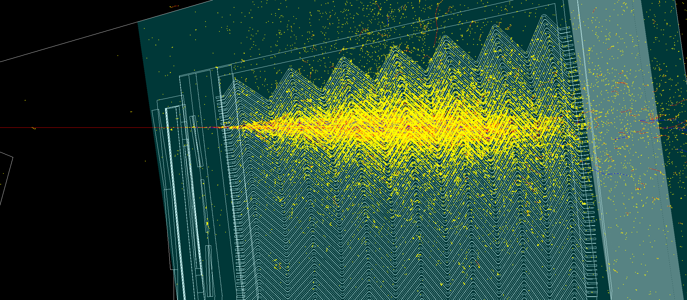

# ATLLArBarrel
A Geant4 simulation of the ATLAS LAr Barrel beam test setup.<br />
<br />


<figure>

<figcaption align="center"><b>Fig. - 100 GeV electron passing through the geometry setup.</b></figcaption>
</figure>
<br/><br/>

<!-- TABLE OF CONTENTS -->
<details open="open">
  <summary>Table of Contents</summary>
  <ol>
    <li><a href="#project-description">Project description</a></li>
    <li><a href="#authors-and-contacts">Authors and contacts</a></li>
    <li><a href="#presentations">Presentations</a></li>
    <li><a href="#available-datasets-and-analyses">Available datasets and analyses</a></li>
    <li>
      <a href="#how-to">How to</a>
      <ul>
        <li><a href="#build-compile-and-execute-on-maclinux">Build, compile and execute on Mac/Linux</a></li>
        <li><a href="#build-compile-and-execute-on-lxplus">Build, compile and execute on lxplus</a></li>
        <li><a href="#debug-with-lldb">Debug with lldb</a></li>
      </ul>
    </li>
    <li><a href="#g4hepem-integration">G4HepEm integration</a></li>
    <li><a href="#using-vecgeom">Using VecGeom</a></li>
  </ol>
</details>

<!--Project desription-->
## Project description
The project targets a standalone Geant4 simulation of the ATLAS LAr Barrel test beam setup. It is used for Geant4 regression testing and physics lists comparison, as well as for testing speeding up solutions.
- ⏰ Start date: February 2023
- 📌 Status: development

<!--Authors and contacts-->
## Authors and contacts
- 👨‍🔬 Lorenzo Pezzotti (CERN EP-SFT) - lorenzo.pezzotti@cern.ch 
- 👨‍🔬 Supervisor: Alberto Ribon (CERN EP-SFT)

<!--Presentations-->
## Presentations
- 🗣️ CERN EP-SFT Simulation Meeting 16/5/2023, [Preliminary results from the ATLLArBarrel test](https://indico.cern.ch/event/1286851/contributions/5408207/attachments/2648311/4584631/lopezzot_16_5_2023.pdf)
- 🗣️ CERN EP-SFT Simulation Meeting 21/3/2023, [Towards a Geant4 ATLAS LAr Barrel Validation Test](https://indico.cern.ch/event/1267983/contributions/5325269/attachments/2615458/4520223/lopezzot_21_3_2023.pdf)

<!--Available datasets and analyses-->
## Available datasets and analyses
We provide datasets and ROOT analyses, as well as instructions for their reproducibility.
Ask authors for access to datasets.

| ATLLArBarrel     | Reproduce data | Reproduce analysis | Comments     |
| -------------    | ----------     | -----------        | -----------  |
| v0.3 <br /> Dataset #1 <br /> tag 0.3_1 | Geant4-11.1 <br /> ALLArBarrel v0.3 <br /> ./ATLLArBarrel -m runcards/run_gps.mac -pl FTFP_BERT -t 8 | root -l v0.3/ATLLArBarrelAnalysis.c | Preliminary esults for gamma and pi-, assuming run_gps_output/ is alongside root macro. Created on 15/05/2023. |

<!--How to-->
## How to

### Build, compile and execute on Mac/Linux
1.  git clone the repo
    ```sh
    git clone https://github.com/lopezzot/ATLLArBarrel.git
    ```
2.  source Geant4-11.1 env
    ```sh
    source /relative_path_to/geant4.11.1-install/bin/geant4.sh
    ```
3.  cmake build directory and make (using geant4.11.1)
    ```sh
    mkdir build; cd build/
    cmake -DGeant4_DIR=/absolute_path_to/geant4.11.1-install/lib/Geant4-11.1.0/ relative_path_to/ATLLarBarrel/
    make
    ```
4.  execute (example with run.mac macro card, 2 threads and FTFP_BERT physics list)
    ```sh
    ./ATLLarBarrel -m run.mac -t 2 -p FTFP_BERT
    ```

Parser options
- `-m macro.mac`: pass a Geant4 macro card (example `-m run.mac` available in source directory and automatically copied in build directory) 
- `-t integer`: pass number of threads for multi-thread execution (example `-t 2`, default is the number of threads on the machine)
- `-p Physics_List`: select Geant4 physics list (example `-p FTFP_BERT`)

### Build, compile and execute on lxplus
1. git clone the repo
   ```sh
   git clone https://github.com/lopezzot/ATLLArBarrel.git
   ```
2. cmake build directory and make (using geant4.11.1, check for gcc and cmake dependencies for other versions)
   ```sh
   mkdir build; cd build/
   source /cvmfs/sft.cern.ch/lcg/contrib/gcc/8.3.0/x86_64-centos7/setup.sh
   source /cvmfs/geant4.cern.ch/geant4/11.1/x86_64-centos7-gcc8-optdeb-MT/CMake-setup.sh
   export CXX=`which g++`
   export CC=`which gcc`
   cmake3 -DGeant4_DIR= /cvmfs/geant4.cern.ch/geant4/11.1/x86_64-centos7-gcc8-optdeb-MT/lib64/Geant4-11.1.0/ ../ATLLArBarrel/
   ```
3. execute (example with TBrun.mac macro card, 2 threads and FTFP_BERT physics list)
   ```sh
   ./ATLLArBarrel -m run.mac -t 2 -p FTFP_BERT
   ```
### Debug with lldb
1. Compile with debug compiler option, make and start debugger
   ```sh
   cmake -DCMAKE_BUILD_TYPE=Debug -DGeant4_DIR=/path-to/geant4-11.1.0-install/lib/Geant4-11.1.0/ /path-to-dir/ATLLArBarrel/
   make
   lldb
   ```
2. Set the lldb target and run with arguments
   ```sh
   target create ATLLArBarrel
   run -m run.mac -p FTFP_BERT -t 2
   ```

<!--G4HepEm integration-->
## G4HepEm integration

[G4HepEm](https://github.com/mnovak42/g4hepem) is a project from the Geant4 Collaboration targeting a library for speeding up the electromagnetic shower generation.
G4HepEm is an optional dependency to ATLLarBarrel. The following are istructions for its usage:
1. Install G4HepEm as described in the [documentation](https://github.com/mnovak42/g4hepem#quick-start)
2. source geant4 env (example with Geant4-11.1)
   ```sh
   source /path-to/geant4-11.1.0/geant4-11.1.0-install/bin/geant4.sh 
    ```
3. Build and compile with G4HepEm
   ```sh
   cmake -DGeant4_DIR=/path-to/geant4-11.1.0/geant4-11.1.0-install/lib/Geant4-11.1.0/ -DG4HepEm_DIR=/path-to/g4hepem-install/lib/cmake/G4HepEm/ -DWITH_G4HepEm=ON ../ATLLArBarrel/
   make
   ```
4. Execute (example with run.mac macro, 2 threads and FTFP_BERT physics list)
   ```sh
   ./ATLLArBarrel -m run.mac -t 2 -p FTFP_BERT
   ```
   
Note: the `-DWITH_G4HepEm=ON` will compile the files under `hepemlib/` that are needed to register the `G4HepEmProcess`. It is possible to use the `G4HepEmTrackingManager` instead of the `G4HepEmProcess` using the CMAKE option `-DWITH_G4HepEmTracking=ON`.
   ```sh
   cmake -DGeant4_DIR=/path-to/geant4-11.1.0/geant4-11.1.0-install/lib/Geant4-11.1.0/ -DG4HepEm_DIR=/path-to/g4hepem-install/lib/cmake/G4HepEm/ -DWITH_G4HepEm=ON -DWITH_G4HepEmTracking=ON ../ATLLArBarrel/ 
   ```

<!--Using VecGeom-->
## Using VecGeom

[VecGeom](https://gitlab.cern.ch/VecGeom/VecGeom) is a geometry modeller library and optional dependency to Geant4. ATLLArBarrel can be used with VecGeom. The following are my instructions for VecGeom usage:
1. Install VecGeom (example with VecGeom-v1.2.1)
   ```sh
   cd VecGeom-v1.2.1/
   mkdir build; cd build
   cmake -DCMAKE_INSTALL_PREFIX=/absolute-path-to/VecGeom-v1.2.1/install/ -DVECGEOM_BUILTIN_VECCORE=ON ..
   cmake --build .
   cmake --build . --target install
   ```
2. Install Geant4 with VecGeom dependency (example with geant4-11.1.0)
   ```sh
   mkdir buildg4vecgeom; cd buildg4vecgeom
   cmake -DCMAKE_INSTALL_PREFIX=/abolute-path-to/installg4vecgeom -DGEANT4_INSTALL_DATA=ON -DGEANT4_USE_QT=ON -DGEANT4_BUILD_MULTITHREADED=ON -DGEANT4_USE_USOLIDS=ON -DVecGeom_DIR=/abolute-path-to/VecGeom-v1.2.1/install/lib/cmake/VecGeom/ -DGEANT4_USE_GDML=ON /relative-path-to/geant4-11.1.0/
   make -jN
   make install
   ```
3. Build ATLLArBarrel
   ```sh
   git clone https://github.com/lopezzot/ATLLArBarrel.git
   source /path_to/installg4vecgeom/bin/geant4.sh
   mkdir build; cd build/
   cmake -DGeant4_DIR=/absolute-path_to/installg4vecgeom/lib/Geant4-11.1.0/ -DVecGeom_DIR=/abolute-path-to/VecGeom-v1.2.1/install/lib/cmake/VecGeom /relative_path_to/ATLLarBarrel/
   make
   ```
Note: the instructions above build VecGeom in backend scalar mode. To build it in backend vector use this [script](scripts/vecgeom_backendvc_install.sh), then specify `-DVc_DIR` when building the simulation.
